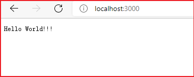

# 1.简介

## 1.1 Koa介绍

* koa 是由 Express 原班人马打造的，致力于成为一个更小、更富有表现力、更健壮的 Web 框架。
* 使用 koa 编写 web 应用，可以免除重复繁琐的回调函数嵌套， 并极大地提升错误处理的效率。
* koa 不在内核方法中绑定任何中间件，它的特点是优雅、简洁、表达力强、自由度高。
* 本身代码只有1000多行，它仅仅提供了一个轻量优雅的 函数库，
* 所有功能都通过插件实现，很符合 Unix 哲学。 使得编写 Web 应用变得得心应手。
* 开发思路和 express 差不多，最大的特点就是 可以避免异步嵌套。

## 1.2 准备

Koa2 的安装与使用对 Node.js 的版本也是有要求的，Node.js 是有要求的，它要求 Node.js 版本高于 V7.6。
因为 node.js 7.6 版本 开始完全支持 async/await，所以才能完全支持 Koa2。

## 1.3 Koa的简单使用

1. 在`code/01-basic`文件夹下,打开命令行窗口,初始化项目，创建package.json，输入以下命令:

```bash
npm init -y
```

2. 在第一步的基础上，继续下载 koa框架， 输入以下命令:

```bash
npm i koa
```

3. 在`code/01-basic`文件夹下，创建一个js文件，在js文件中，编写如下代码:

```js
// 1. 导入 Koa 包
const Koa = require('koa');
// 2. 使用 new 调用 koa() 构造函数，来创建应用程序
const app = new Koa();
// 3. 监听 指定的 3000 端口
app.listen(3000);
```

4. 在`code/01-basic`文件夹下，打开命令行窗口，输入以下命令

```bash
 node app.js
```

5. 打开浏览器，访问`http://localhost:3000`。你会看到如下图所示效果:


上图表示 该服务没有发现任何内容。这是因为我们并没有告诉Koa应该显示什么内容

## 1.4 Koa返回数据给浏览器

1. 在`code/02-basic`文件夹下,打开命令行窗口,初始化项目，创建package.json，输入以下命令:

```bash
npm init -y
```

2. 在第一步的基础上，继续下载 koa框架， 输入以下命令:

```bash
npm i koa
```

3. 在`code/02-basic`文件夹下，创建一个js文件，在js文件中，编写如下代码:

```js
// 1. 导入 Koa 包
const Koa = require('koa');
// 2. 使用 new 调用 koa() 构造函数，来创建应用程序
const app = new Koa();
// 3.使用app来调用use中间件
app.use(async ctx =>{
  // 响应给浏览器 一个字符串 "Hello World!!!"
  ctx.body = "Hello World!!!"
})
// 4. 监听 指定的 3000 端口
app.listen(3000, ()=>{
  console.log("服务运行在 http://localhost:3000")
});
```

4. 在`code/02-basic`文件夹下，打开命令行窗口，输入以下命令

```bash
 node app.js
```

5. 打开浏览器，访问`http://localhost:3000`。你会看到如下图所示效果：



上图表示 该服务给浏览器返回一个字符串"Hello World!!!"。
